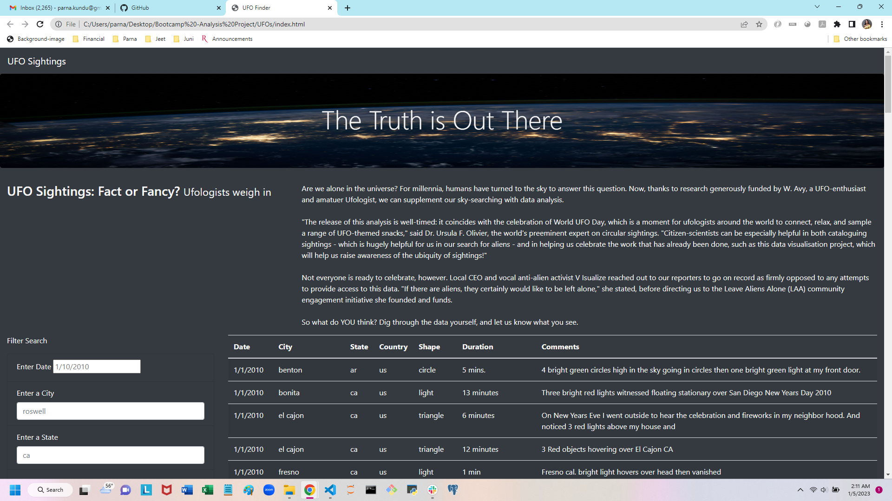

# UFO sightings

## Overview 

This project uses UFO sighting data to build a Dynamic Webpage using Javascript and HTML. The UFO data is displayed neatly in a table format and filters are added to let users refine their search on more than one level. This table is then inserted into and displayed in an HTML page. Basic HTML, Bootstrap and CSS is used to build and style the webpage. The webpage also includes an attention grabbing header, article summary and a brief article.

## Results

UFO sightings have been recorded all over USA and Canada. This information is displayed in a neat table on a webpage. Unfortunately, there is a lot of information, which makes it cumbersome for users to scroll and view data that would be of interest to them. To ease viewing data, filtering options have been added to the webpage. 

A user is given the oppurtunity to filter data based on Date, City, State, Country and Shape of UFO sighted or a combination of any of these criteria. This would allow the users to interactively use the webpage to view only required data. 

Here is an example :-

*   When the webpage is loaded for the first time, all the UFO data is loaded and displayed in a table format as below :- 
.

*   Now the user has the ability to refine their search by selecting any of the filter criteria. Using the "Date" field of 1/4/2010, the table is considerably reduced as it displays only the sightings on 1/4/2010 as seen [here](https://github.com/ParnaKundu/UFOs/blob/main/static/images/UFO_sightings_2.png).

*   To drill down further the user can select the "City" as "ca'. The results are seen [here](https://github.com/ParnaKundu/UFOs/blob/main/static/images/UFO_sightings_3.png).

*   A user may also choose to filter the data based on "State" as 'ca' and "shape" as 'light' alone. The results are seen [here](https://github.com/ParnaKundu/UFOs/blob/main/static/images/UFO_sightings_4.png).

This dynamic webpage gives total control to users to filter based on any or multiple criteria as they wish and the page will refresh accordingly as soon as a change is made.

The End result is a presentation of data that is both visually appealing and interactive.

## Summary

A drawback of this design is that once a filter criteria is chosen, it will need to be deleted or updated if new data needs to be displayed.

Recommendations for further development:- 
1.  A drop down menu can be added to the filter box which allows the user to select specific data to be displayed.

2.  A reset button can be added so the user will not have to manually remove their existing selection in order for the page to be refreshed.
